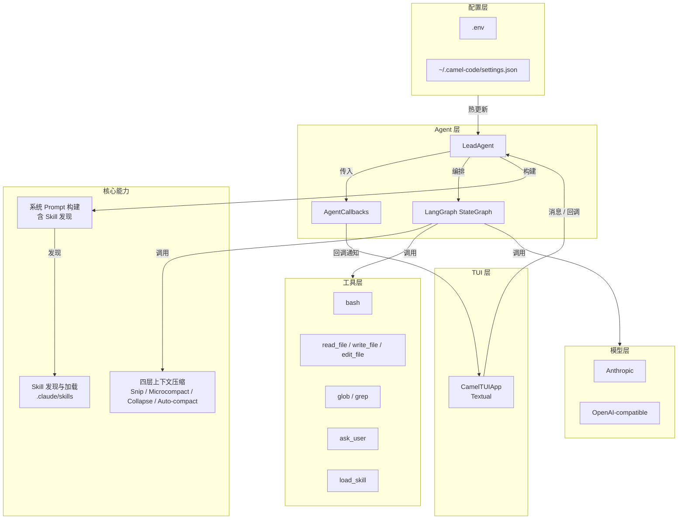

[English](ARCHITECTURE_EN.md)

# CamelCode 架构设计

本文档描述 CamelCode 的整体架构、核心模块职责与数据流转。

## 总览

CamelCode 是一个运行在终端里的 AI 编程助手，核心由以下层次组成：

## 模块职责

### 1. TUI 层（`src/tui/`）

基于 [Textual](https://github.com/Textualize/textual) 的富文本终端界面。

- `CamelTUIApp`: 应用主类，组装 Header、Transcript、InputBox、FooterBar。
- 通过 `AgentCallbacks` 将 UI 更新函数传给 `LeadAgent.run_agent_turn()`。
- 处理斜杠命令（`/help`、`/tools`、`/clear`、`/model`、`/quit`）。
- 当 `ask_user` 触发时弹出 `QuestionScreen` 模态对话框。

### 2. Agent 层（`src/agents/`）

- `LeadAgent`: 对外暴露 `run_agent_turn()`，内部构建并执行 LangGraph 状态图。
- `build_graph()`: 构建 `compress → llm → tool_node → 条件路由` 的 ReAct 循环。
- `AgentCallbacks`: 类型化的回调集合，包括 `on_tool_start`、`on_tool_result`、`on_assistant_message`、`on_progress_message`、`on_context_stats`、`on_compression`。Agent 通过回调与 TUI 解耦。

### 3. 上下文压缩层（`src/compact/`）

四层压缩策略，帮助长对话保持在模型上下文窗口内：

1. **Snip Compact**: 上下文利用率高时裁剪中间回合。
2. **Microcompact**: 清空旧工具结果，保留最近几个。
3. **Context Collapse**: 将旧消息折叠为摘要视图。
4. **Auto Compact**: 上下文危急时由 LLM 生成摘要。

### 4. 工具层（`src/tools/`）

| 工具 | 用途 |
|------|------|
| `bash` | 运行白名单内的 shell 命令 |
| `read_file` | 读取工作区文本文件 |
| `write_file` | 写入文件内容 |
| `edit_file` | 精确替换文件中的文本 |
| `glob` | 按模式搜索文件 |
| `grep` | 按正则搜索代码 |
| `ask_user` | 向用户提出澄清问题并暂停当前回合 |
| `load_skill` | 按名称加载项目或用户目录下的 `SKILL.md` 内容 |

### 5. Skill 层（`src/skill/`）

- 自动发现项目级 `.claude/skills` 和用户级 `~/.claude/skills` 下的 `SKILL.md`。
- `SKILL.md` 使用 YAML frontmatter 定义元数据（`name`、`description`），后续为 Markdown 详细内容。
- `load_skill` 工具被注册到 Agent，系统 prompt 会列出可用 skill 并提示 Agent 在匹配时先调用 `load_skill`。

### 6. 模型层（`src/models/`）

- 支持 Anthropic 和 OpenAI 兼容接口。
- 运行时可通过 `~/.camel-code/settings.json` 或环境变量切换模型、API Key、Base URL。

### 7. 配置层（`src/config.py`）

- 支持 `.env`、`settings.json`、环境变量三级配置。
- 每个 Agent 回合前重新加载，实现配置热更新。

## 数据流转

1. 用户输入进入 `CamelTUIApp`，追加到消息历史。
2. `CamelTUIApp` 构造 `AgentCallbacks`，调用 `LeadAgent.run_agent_turn(messages, callbacks=...)`。
3. `LeadAgent` 构建 `StateGraph` 并注入 callbacks。
4. `compress_node` 对消息历史执行四层压缩，生成 `model_messages`；通过 `on_context_stats` / `on_compression` 通知 TUI。
5. `llm_node` 将 `model_messages` 传给 LLM，LLM 决定返回文本或 tool_calls；通过 `on_assistant_message` / `on_progress_message` 通知 TUI。
6. 如有 tool_calls，`tool_node` 依次调用工具；通过 `on_tool_start` / `on_tool_result` 通知 TUI。
7. 工具结果过大时，`replace_large_tool_result()` 自动持久化到 `.tool_results/`。
8. 若 `ask_user` 返回 `await_user` 标记，回合结束并等待用户回复。

## 扩展方向

- **LangGraph checkpoints**: 持久化图状态，支持从任意节点恢复。
- **LangGraph interrupts**: 在关键节点暂停，等待人工审核后继续。
- **Agent 记忆系统**: 将关键决策、项目约定写入 `.camel-code/memory/` 并注入 system prompt。
- **MCP 接入**: 通过 Model Context Protocol 连接外部服务器，扩展工具、资源、prompts。
