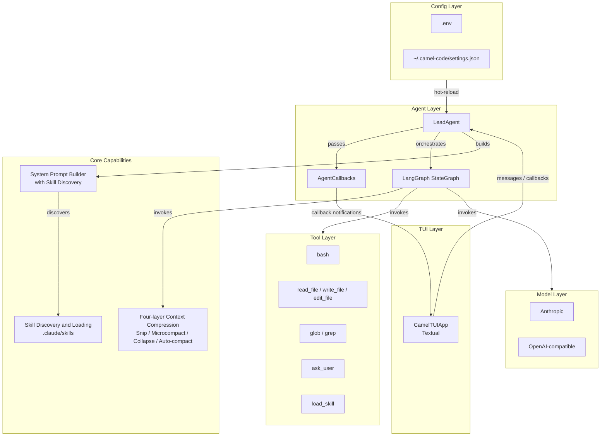

[中文](ARCHITECTURE.md)

# CamelCode Architecture

This document describes the overall architecture, module responsibilities, and data flow of CamelCode.

## Overview

CamelCode is a terminal-based AI coding assistant composed of the following layers:

## Module Responsibilities

### 1. TUI Layer (`src/tui/`)

A rich terminal UI built on [Textual](https://github.com/Textualize/textual).

- `CamelTUIApp`: Main app class that assembles Header, Transcript, InputBox, and FooterBar.
- Passes UI update functions to `LeadAgent.run_agent_turn()` via `AgentCallbacks`.
- Handles slash commands (`/help`, `/tools`, `/clear`, `/model`, `/quit`).
- Pops up a `QuestionScreen` modal when `ask_user` is triggered.

### 2. Agent Layer (`src/agents/`)

- `LeadAgent`: Exposes `run_agent_turn()` and internally builds and executes the LangGraph state graph.
- `build_graph()`: Builds the ReAct loop `compress → llm → tool_node → conditional routing`.
- `AgentCallbacks`: A typed set of callbacks including `on_tool_start`, `on_tool_result`, `on_assistant_message`, `on_progress_message`, `on_context_stats`, and `on_compression`. The Agent uses callbacks to stay decoupled from the TUI.

### 3. Context Compression Layer (`src/compact/`)

Four-layer compression strategy to keep long conversations within model context windows:

1. **Snip Compact**: Drop middle-turn messages when utilization is high.
2. **Microcompact**: Clear old tool results, keep the most recent ones.
3. **Context Collapse**: Summarize older messages into a collapsed view.
4. **Auto Compact**: LLM-based summary when context is critical.

### 4. Tool Layer (`src/tools/`)

| Tool | Purpose |
|------|---------|
| `bash` | Run allowlisted shell commands |
| `read_file` | Read a text file from the workspace |
| `write_file` | Write content to a file |
| `edit_file` | Replace exact text in a file |
| `glob` | Search files by pattern |
| `grep` | Search code by regex |
| `ask_user` | Ask the user a clarifying question and pause the turn |
| `load_skill` | Load the content of a `SKILL.md` from project or user skills directory |

### 5. Skill Layer (`src/skill/`)

- Automatically discovers `SKILL.md` files under project-level `.claude/skills` and user-level `~/.claude/skills`.
- `SKILL.md` uses YAML frontmatter for metadata (`name`, `description`), followed by detailed Markdown content.
- The `load_skill` tool is registered in the Agent. The system prompt lists available skills and instructs the Agent to call `load_skill` first when a skill matches.

### 6. Model Layer (`src/models/`)

- Supports Anthropic and OpenAI-compatible endpoints.
- Model, API key, and base URL can be switched at runtime via `~/.camel-code/settings.json` or environment variables.

### 7. Config Layer (`src/config.py`)

- Supports three-level configuration: `.env`, `settings.json`, and environment variables.
- Reloaded before each Agent turn for hot-reload support.

## Data Flow

1. User input enters `CamelTUIApp` and is appended to the message history.
2. `CamelTUIApp` constructs `AgentCallbacks` and calls `LeadAgent.run_agent_turn(messages, callbacks=...)`.
3. `LeadAgent` builds the `StateGraph` and injects callbacks.
4. `compress_node` runs the four-layer compression to produce `model_messages`; notifies the TUI via `on_context_stats` / `on_compression`.
5. `llm_node` sends `model_messages` to the LLM, which returns text or tool_calls; notifies the TUI via `on_assistant_message` / `on_progress_message`.
6. If there are tool_calls, `tool_node` invokes tools sequentially; notifies the TUI via `on_tool_start` / `on_tool_result`.
7. If a tool result is too large, `replace_large_tool_result()` persists it to `.tool_results/`.
8. If `ask_user` returns the `await_user` flag, the turn ends and waits for user reply.

## Future Directions

- **LangGraph checkpoints**: Persist graph state and resume from any node.
- **LangGraph interrupts**: Pause at critical nodes and continue after human review.
- **Agent memory system**: Write key decisions and project conventions to `.camel-code/memory/` and inject them into the system prompt.
- **MCP integration**: Connect to external servers via Model Context Protocol to extend tools, resources, and prompts.
