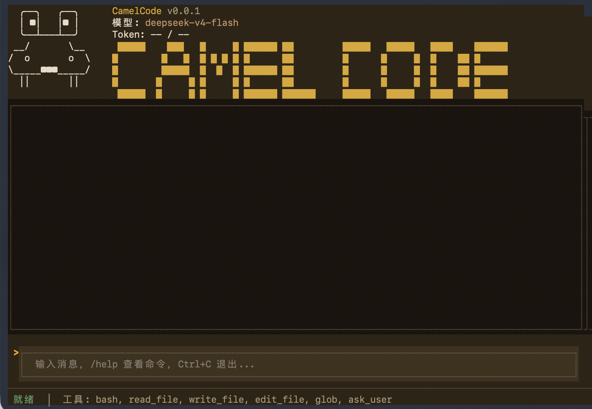

[English](README_EN.md) · [路书](ROADMAP.md) · [架构](ARCHITECTURE.md)

# CamelCode 🐫

[](https://www.python.org/downloads/)
[](LICENSE)

CamelCode 是一个运行在终端里的 AI 编程助手。它把轻量级 TUI、LangGraph 驱动的 Agent 循环和四层上下文压缩管道结合起来，帮你在工作区中读代码、改代码、跑命令、做推理。
适合agent初学者了解基本agentloop+基本harness工程。



## 功能特性

- **TUI 界面**：富文本终端界面（`python main.py`）。
- **工具型 Agent**：读文件、写文件、改文件、运行命令、glob 搜索，并在需要时向你提问澄清。
- **四层上下文压缩**：Snip → Microcompact → Context Collapse → Auto-compact，帮助长对话保持在模型上下文窗口内。
- **Skill 发现与加载**：自动发现项目级与用户级 `.claude/skills` 下的 `SKILL.md`，并在系统 prompt 中列出；用户提及 skill 时，Agent 会先调用 `load_skill` 加载详情。
- **配置热更新**：运行时修改模型、API Key、Base URL 无需重启。
- **多模型后端**：默认支持 Anthropic 和 OpenAI 兼容接口。
- **中英双语风格**：代码用英文，注释和界面用中文。

## 快速开始

### 1. 克隆仓库

```bash
git clone https://github.com/Camelovee/Camel-Code.git
cd Camel-Code
```

### 2. 创建虚拟环境

```bash
python -m venv venv
source venv/bin/activate  # Windows: venv\Scripts\activate
```

### 3. 安装依赖

```bash
pip install -r requirements.txt
```

### 4. 配置模型

复制示例环境文件并填入你的 API Key：

```bash
cp .env.example .env
```

编辑 `.env`：

```env
MODEL_PROVIDER=anthropic
MODEL_ID=claude-3-5-sonnet
MODEL_API_KEY=sk-your-api-key-here
```

或者使用 `~/.camel-code/settings.json`：

```json
{
  "model": "claude-3-5-sonnet",
  "ANTHROPIC_AUTH_TOKEN": "sk-your-api-key-here"
}
```

配置支持热更新，下一次 Agent 回合自动生效。

### 5. 运行

```bash
python main.py
```

## 使用说明

在 TUI 中输入消息并按 **回车**，Agent 会使用工具推理并在对话区回复。

### 斜杠命令

| 命令 | 说明 |
|------|------|
| `/help` | 显示可用命令 |
| `/tools` | 列出已注册工具 |
| `/clear` | 清空对话历史 |
| `/model` | 显示当前模型信息 |
| `/quit` | 退出应用 |

### 当 Agent 需要你的输入

如果 CamelCode 对你的意图不确定，它会调用 `ask_user` 工具并弹出模态对话框。你可以回答问题或取消，Agent 会根据你的回复继续。

## 架构

```text
┌─────────────────────────────────────────────────────────────┐
│                         CamelTUIApp                          │
│  (Textual UI: Header, Transcript, InputBox, FooterBar)       │
└───────────────────────┬─────────────────────────────────────┘
                        │
┌───────────────────────▼─────────────────────────────────────┐
│                        LeadAgent                             │
│  ┌─────────────┐    ┌─────┐    ┌──────────┐                │
│  │  compress   │───▶│ llm │───▶│ tool_node│                │
│  └─────────────┘    └─────┘    └────┬─────┘                │
│                                     │                        │
│                         ┌───────────▼────────────┐          │
│                         │  检测到 ask_user？      │          │
│                         │  是 → 暂停等待用户      │          │
│                         │  否 → 继续工具循环      │          │
│                         └────────────────────────┘          │
└─────────────────────────────────────────────────────────────┘
```

### 上下文压缩管道

长工具输出和对话历史通过四层策略管理：

1. **Snip Compact**：利用率高时裁剪中间回合。
2. **Microcompact**：清空旧工具结果，保留最近几个。
3. **Context Collapse**：将旧消息折叠为摘要视图。
4. **Auto Compact**：上下文危急时由 LLM 生成摘要。

## 内置工具

| 工具 | 用途 |
|------|------|
| `bash` | 运行白名单内的 shell 命令 |
| `read_file` | 读取工作区文本文件 |
| `write_file` | 写入文件内容 |
| `edit_file` | 精确替换文件中的文本 |
| `glob` | 按模式搜索文件 |
| `ask_user` | 向用户提出澄清问题并暂停当前回合 |
| `load_skill` | 按名称加载项目或用户目录下的 `SKILL.md` 内容 |

## 开发

### 运行测试

```bash
PYTHONPATH=$(pwd) pytest test/ -v
```

### 项目结构

```text
.
├── main.py                 # TUI 入口
├── src/
│   ├── agents/             # LeadAgent + LangGraph
│   ├── compact/            # 四层压缩管道
│   ├── models/             # LLM 适配器
│   ├── prompts.py          # 系统提示词（含 skills 发现）
│   ├── skill/              # Skill 发现、加载与 schema 定义
│   ├── tools/              # 工具定义
│   ├── tui/                # Textual 界面
│   └── utils/              # Token 估算等
├── test/                   # pytest 测试
└── docs/                   # 设计文档（不入版本库）
```

## 贡献指南

欢迎提交 Issue 和 Pull Request！

1. Fork 本仓库
2. 创建功能分支（`git checkout -b feature/amazing-feature`）
3. 提交改动（`git commit -m 'feat: add amazing feature'`）
4. 推送到分支（`git push origin feature/amazing-feature`）
5. 发起 Pull Request

## 许可证

[MIT](LICENSE)

## 致谢

基于 [LangChain](https://github.com/langchain-ai/langchain)、[LangGraph](https://github.com/langchain-ai/langgraph) 和 [Textual](https://github.com/Textualize/textual) 构建。
